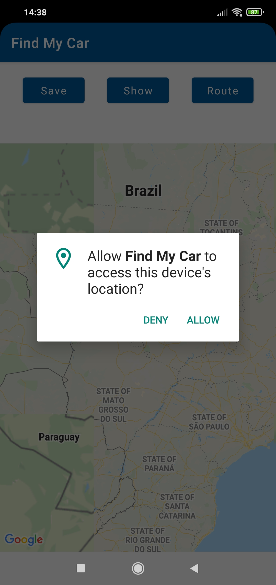
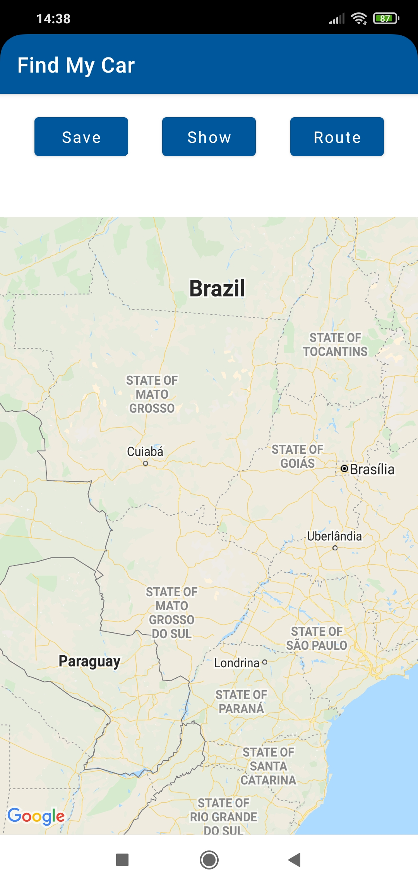
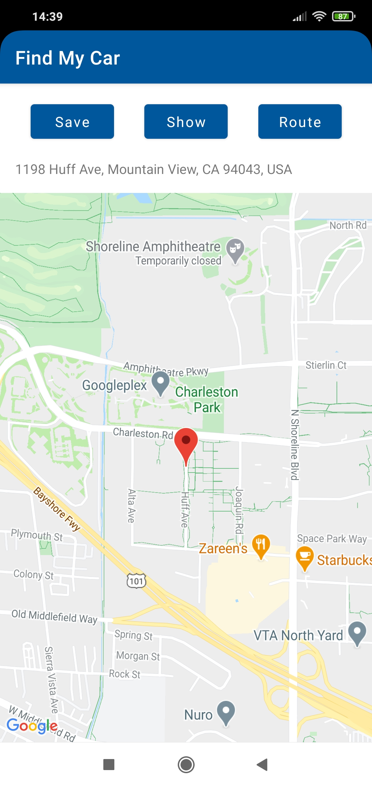
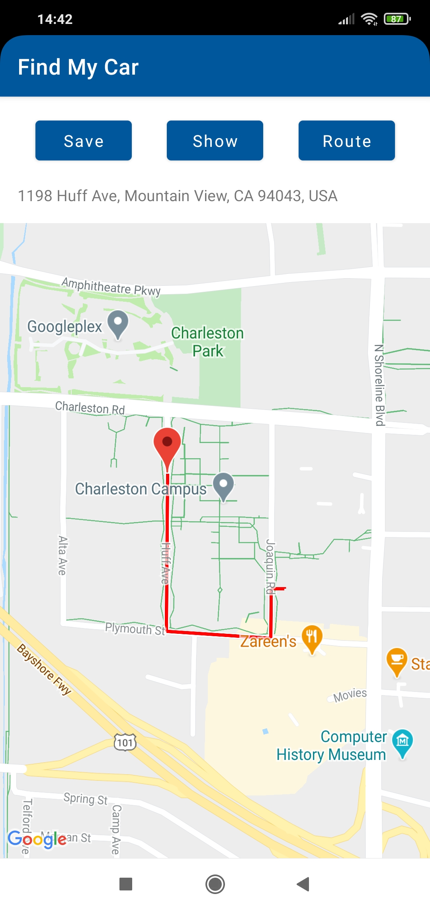

# Find My Car
An android app that allows you to save the location where you parked your car.  
The location is stored on the device so in case the app is closed the location can be restored.    
You can  
* Save the location
* Show the location saved on the map
* Trace a route from your current location to the saved location

### Phone display:

 

 

## Library

* [Maps SDK for Android](https://developers.google.com/maps/documentation/android-sdk/overview)
* [Places SDK for Android](https://developers.google.com/places/android-sdk/overview)
* [Moshi](https://github.com/square/moshi)
* [Retrofit](https://square.github.io/retrofit/)
* [Room Persistence Library](https://developer.android.com/training/data-storage/room)
* [Kotlin coroutines](https://developer.android.com/kotlin/coroutines)

## API
* [Google Directions API](https://developers.google.com/maps/documentation/directions/start)

## App Architecture
* MVP
* Kotlin

## Developed By

Paulo Sabaini